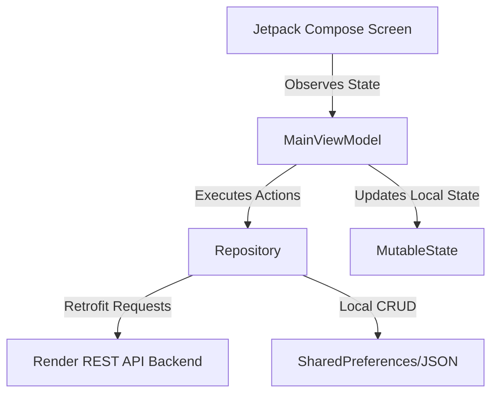

# Sentinel Android Application - Architecture Report

## 1. Executive Summary
The Sentinel Android application is an enterprise-grade mobile safety platform. It is engineered with a modern Kotlin-based Jetpack Compose UI architecture, adhering to the MVVM (Model-View-ViewModel) design pattern. The application enables real-time journey tracking, risk scoring, safe route planning, and emergency SOS broadcasting to trusted contacts.

---

## 2. Technology Stack & Key Dependencies

### Core Specifications
* **Programming Language**: Kotlin (JVM target 11)
* **UI Toolkit**: Jetpack Compose (Material Design 3 Components)
* **Target Android SDK**: API Level 36
* **Minimum Android SDK**: API Level 26

### External Library Configuration
* **Navigation**: `androidx.navigation:navigation-compose:2.7.7` for single-activity routing.
* **Network & Parsing**: `retrofit2:retrofit:2.9.0` with `converter-gson` and scalars for JSON communication.
* **Coroutines**: `kotlinx-coroutines-android:1.7.3` for asynchronous background thread scheduling.
* **Mapping Components**: `maps-compose:4.3.0` & Google Play Services Maps API (`19.0.0`) for active routing overlays.
* **Location Processing**: Play Services Location (`21.3.0`) for location provider polling.

---

## 3. Architecture Overview (MVVM)

The application follows the clean MVVM design pattern:

### Components
1. **View (Jetpack Compose UI)**: Declarative UI components observing states from `MainViewModel` and triggering UI events based on interactions.
2. **ViewModel (`MainViewModel`)**: Extends `AndroidViewModel` to manage screen state, handle UI event payloads, initiate background coroutines, and coordinate data operations.
3. **Model**: Defines requests and responses (e.g. `LoginRequest`, `EmergencyRequest`, `ReportRequest`, `SafeRouteResponse`).
4. **Data Repository (`Repository` / Client)**: Interfaces with network Retrofit services to manage data fetching and lifecycle.

---

## 4. Services, Receivers & Overlays

### JourneyTrackingService (Foreground Service)
* **Service Type**: `location`
* **Role**: Runs continuously in the background when a journey is active to poll user coordinates and sync location data with the backend API. Uses a persistent notification.

### SafetyActionReceiver (Broadcast Receiver)
* **Role**: Listens for action intents from notifications (e.g. "I'm Safe", "Send SOS") and notifies the ViewModel or starts safety procedures without launching the main activity.

### HoverBubble (System Overlay Window)
* **Role**: Displays a floating overlay button (similar to ridesharing floating overlays) on top of other applications. It allows users to quickly trigger an SOS from outside the application. Requires `SYSTEM_ALERT_WINDOW` permission.

---

## 5. Security & Network Architecture

### Retrofit Clients
* **RetrofitClient**: Interacts with the backend server hosted at `https://sentinel-backend-production-8057.up.railway.app/` for authentication, emergency triggers, and incident reports.
* **DirectionsRetrofit**: Connects to the Google Directions API to fetch route options.
* **GeocodingRetrofit**: Interacts with Google Geocoding API to resolve coordinates to addresses.

### Network Security
* Uses `networkSecurityConfig` defined in XML to enforce secure transport layer standards.

---

## 6. Storage & Session Systems

### SharedPreferences (`SessionManager`)
* Stores session state variables like login flags (`is_logged_in`) and active user emails (`user_email`).

### ContactsManager (Local Filesystem)
* Saves and loads trusted emergency contacts using a simple JSON file or SharedPrefs storage system inside the app context.

---

## 7. Android Manifest Permissions

| Permission | Category | Justification |
|---|---|---|
| `INTERNET` | Normal | Allows the app to connect to the backend APIs and load maps. |
| `ACCESS_FINE_LOCATION` | Dangerous | Necessary to fetch precise location for E2E journey routing. |
| `ACCESS_COARSE_LOCATION` | Dangerous | Fallback coarse location permissions. |
| `SEND_SMS` | Dangerous | Sends SMS notifications with location details to emergency contacts. |
| `FOREGROUND_SERVICE` | Normal | Allows running the tracking service in the background. |
| `POST_NOTIFICATIONS` | Dangerous | Displays tracking notifications and alerts. |
| `FOREGROUND_SERVICE_LOCATION` | Special | Enables location fetching inside foreground services. |
| `ACCESS_BACKGROUND_LOCATION` | Dangerous | Tracks coordinates in background modes. |
| `SYSTEM_ALERT_WINDOW` | Special | Displays the floating SOS bubble overlay over other applications. |
