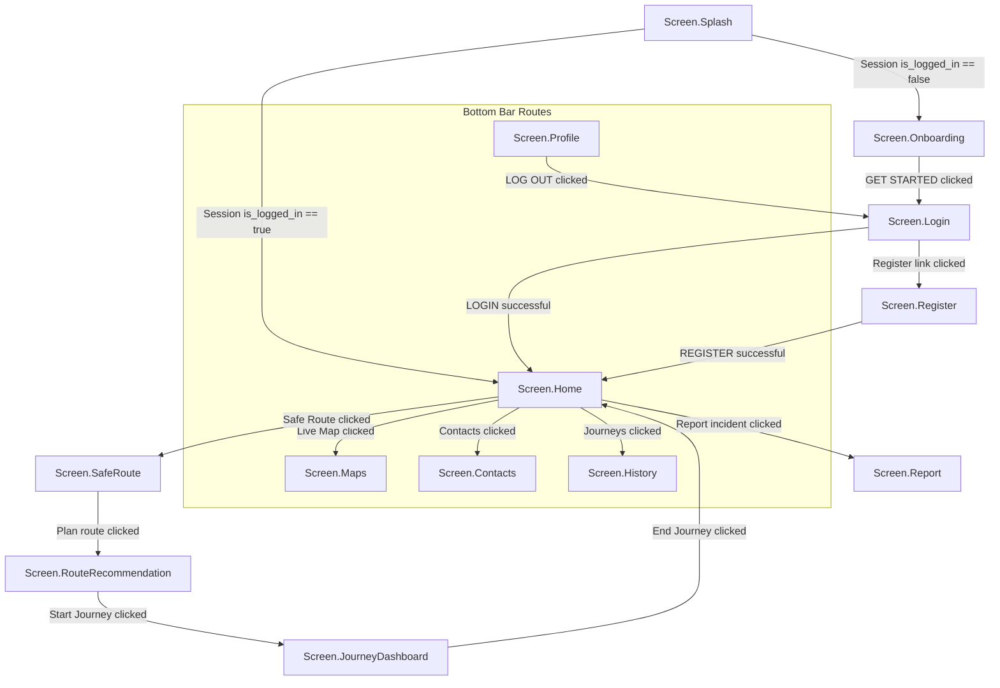

# Sentinel Android Application - Navigation Flow Report

This document maps out the navigation destinations and transitions defined in Jetpack Compose within `MainActivity.kt` using standard Compose router paths.

---

## 1. NavHost Destinations Graph

Below is the state diagram showing how screens transition based on user inputs and application state.

---

## 2. NavHost Routing Table

All screen routes are mapped in `com.sentinel.app.utils.Screen.kt`:

| Destination State | Route Name | Screen Composable | Navigation / Transition Trigger |
|---|---|---|---|
| **Splash** | `splash` | `SplashScreen` | Launching application. Initiates check on `SessionManager.isLoggedIn()`. |
| **Onboarding** | `onboarding` | `OnboardingScreen` | Redirected from Splash if no active session is found. Displays slide indicator. |
| **Login** | `login` | `LoginScreen` | Loaded after onboarding or when logging out of profile. |
| **Register** | `register` | `RegisterScreen` | Loaded when registration option is selected from login. |
| **Home** | `home` | `HomeScreen` | Dashboard of application. Displays Bottom Navigation Bar. |
| **Maps** | `maps` | `MapScreen` | Accessible from bottom bar or Quick Actions. Shows incident markers. |
| **Report** | `report` | `ReportScreen` | Form to report community hazards. |
| **Contacts** | `contacts` | `EmergencyContactsScreen` | Configuration panel for emergency circle. |
| **History** | `history` | `HistoryScreen` | Displays past journey logs. |
| **Profile** | `profile` | `ProfileScreen` | Allows profile detail customization and session logout. |
| **SafeRoute** | `safe_route` | `SafeRouteScreen` | Input form for source/destination path evaluation. |
| **RouteRecommendation** | `route_recommendation` | `RouteRecommendationScreen` | Renders calculated paths ranked by danger factors. |
| **JourneyDashboard** | `journey_dashboard` | `JourneyDashboardScreen` | Renders active tracking dashboard with metrics and updates. |

---

## 3. Navigation Best Practices Implemented

* **PopUpTo Configurations**: During authorization redirects (e.g., transition from `Splash` -> `Home` or `Login` -> `Home`), the backstack is cleared up to the current screen with `inclusive = true`. This prevents users from returning to splash/login screens via the system back button.
* **Single Activity Architecture**: All transitions occur inside `MainActivity` using Compose `NavHost`, ensuring smooth transitions and lower memory usage compared to traditional multi-activity frameworks.
